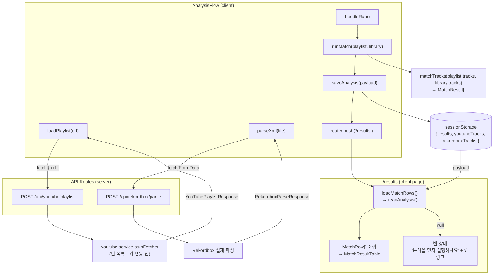

# Analysis Integration — 설계 (Spec)

- 작성일: 2026-05-31
- 상태: 승인됨 (brainstorming)
- 관련 문서: `docs/ARCHITECTURE.md` §3·§4·§7·§12·§19, `docs/ADR.md` ADR-003·ADR-004, `docs/PRD.md` §8

## 1. 배경 / 목적

Phase 2~4가 모두 머지되어(`chore/contract-foundation` 스택) MVP 흐름이 **mock으로 end-to-end 동작**한다. 하지만 실제 데이터로 연결되지 않은 두 가지 공백이 있다.

1. **데이터 흐름 단절** — `AnalysisFlow`가 `runMatch` 결과를 버리고 `/results`로 이동하는데, `/results`는 독립적으로 `loadMatchRows()`(mock)를 읽는다. 실제 매칭을 돌려도 결과가 `/results`로 전달되지 않는다.
2. **mock → 실제 미연결** — `analysis.service`는 `sample-data`를 반환하고, matcher 엔진(`src/lib/matcher`)은 어디서도 호출되지 않는다. (Rekordbox 파싱·API 라우트는 이미 실제 동작)

이 작업의 목적은 **mock을 실제 API 라우트 + matcher 엔진에 배선하고, 매칭 결과를 `/results`로 전달**하는 것이다. 실제 YouTube Data API 연동(키 필요)은 범위에서 제외한다.

## 2. 범위

### 포함
- `analysis.service`의 `loadPlaylist`/`parseXml`를 실제 API 라우트(`/api/youtube/playlist`, `/api/rekordbox/parse`) `fetch` 호출로 교체, `ApiResult` 언랩.
- `analysis.service`의 `runMatch`를 matcher 엔진(`matchTracks`) 호출로 교체.
- 매칭 결과 → `/results` 핸드오프 (sessionStorage).
- `/results` 페이지가 핸드오프 데이터에서 `MatchRow[]`를 조립하도록 교체 + 빈 상태 처리.
- 영향받는 테스트 재작성/추가.

### 제외
- 실제 YouTube Data API v3 fetcher 구현 및 `YOUTUBE_API_KEY` 연동 (`youtube.service`의 `stubFetcher`는 그대로 유지 — 키 연동 전까지 빈 목록 반환).
- 가격 조회/구매 액션 (Phase 5).
- 분석 내역 영속 저장·삭제 (Phase 6).
- 전역 상태 라이브러리 도입 (ARCHITECTURE §273: MVP 미도입 방침).

## 3. 확정된 결정

| 항목 | 결정 | 근거 |
|---|---|---|
| 매칭 실행 위치 | 클라이언트 `analysis.service`에서 matcher lib 직접 호출 | matcher는 순수 lib(키·쿼터 없음). `services → lib` 의존 허용. `/api/analysis` 라우트는 playlist/library 재전송만 늘 뿐 이득 없음 |
| `/results` 핸드오프 | sessionStorage (단일 모듈) | ARCHITECTURE §273 전역 상태 라이브러리 미도입 방침과 부합. Context는 새로고침 시 소실·구조 복잡 |
| 핸드오프 페이로드 | `{ results, youtubeTracks, rekordboxTracks }` | `loader`가 기존과 동일하게 `MatchRow[]`를 조립(단일 transform 지점 유지). 원본 XML·키 미포함 (ADR-004) |
| 핸드오프 모듈 위치 | `src/services/analysis-handoff.ts` (신규) | 분석 유스케이스의 클라이언트 영속 경계. key를 한 곳에 두어 `AnalysisFlow`/`loader` 간 중복 방지 |
| `/results` 렌더 | server component → client component 전환 | sessionStorage는 브라우저 전용 |

## 4. 데이터 흐름 (목표)



## 5. 작업 상세

### 5.1 `src/services/analysis.service.ts` (교체)
파일 상단 mock 주석·`sample-data` import·`delay`를 제거한다.

- `loadPlaylist(url)`: `parsePlaylistUrl(url)`로 선검증(유효하지 않으면 기존처럼 throw) 후, `fetch("/api/youtube/playlist", { method: "POST", body: JSON.stringify({ url }) })`. `ApiResult`를 언랩 — `ok:false`면 `error.message`로 `throw new Error(...)`.
- `parseXml(file)`: `.xml` 확장자 선검증 유지. `FormData`에 `file` 담아 `fetch("/api/rekordbox/parse", { method: "POST", body: form })`. 동일하게 언랩/throw.
- `runMatch(playlist, library)`: `matchTracks(playlist.tracks, library.tracks)`를 반환(동기 → `Promise.resolve` 래핑 또는 `async`). 시그니처(인자·반환 `MatchResult[]`)는 유지.
- 공통 언랩 헬퍼를 파일 내부에 둔다(예: `unwrap<T>(res: ApiResult<T>): T`).

### 5.2 `src/services/analysis-handoff.ts` (신규)
```ts
export type AnalysisHandoff = {
  results: MatchResult[];
  youtubeTracks: YouTubeTrack[];
  rekordboxTracks: RekordboxTrack[];
};
export function saveAnalysis(payload: AnalysisHandoff): void   // sessionStorage.setItem(KEY, JSON.stringify)
export function readAnalysis(): AnalysisHandoff | null         // 없거나 malformed면 null
```
- 단일 `KEY = "crate-finder:analysis"`.
- `sessionStorage` 미가용(SSR)·`JSON.parse` 실패 시 안전하게 `null`/no-op.

### 5.3 `src/components/analysis/AnalysisFlow.tsx` (수정)
- `handleRun`에서 `const results = await runMatch(playlist, library);` 후
  `saveAnalysis({ results, youtubeTracks: playlist.tracks, rekordboxTracks: library.tracks });` 그 다음 `router.push("/results")`.
- 그 외 상태·에러 처리·UI는 변경 없음.

### 5.4 `src/app/results/loader.ts` (교체)
- `sample-data` import 제거. `readAnalysis()` 호출.
- 데이터 없으면 `[]` 반환.
- 있으면 기존과 동일한 방식으로 `MatchRow[]` 조립:
  `results.map(r => ({ result: r, youtubeTrack: yt.find(...id), matchedTrack: rb.find(...matchedId) }))`.
  - 단, mock과 달리 `youtubeTrack`이 없을 수 있는 경우를 방어(`!` 단언 제거, 누락 시 해당 행 skip 또는 안전 처리).

### 5.5 `src/app/results/page.tsx` (수정)
- `"use client"` 전환. **sessionStorage는 SSR에서 읽으면 hydration mismatch가 나므로**, `useState`는 빈 값(`[]` 또는 `null`)으로 시작하고 `useEffect`에서 `loadMatchRows()`로 채운다.
- `rows.length === 0`이면 빈 상태 UI: "분석을 먼저 실행하세요" + `/`로 가는 링크/버튼. (정상 0곡 매칭과 직접진입을 구분할 필요는 없음 — 둘 다 동일 안내로 충분)
- 주의: 초기 마운트(데이터 채우기 전)와 빈 상태를 구분하지 못하면 분석 직후에도 잠깐 빈 상태가 보일 수 있다. `useEffect`는 동기적으로 첫 paint 직후 실행되므로 실무상 무방하나, 필요 시 `loaded` 플래그로 초기/빈 상태를 분리한다.

## 6. 에러 / 보안 / 엣지

- 라우트 `{ ok:false }` → service throw → 기존 `AnalysisFlow`의 `role="alert"` 재사용.
- stub fetcher라 플레이리스트 0곡 가능 → `matchTracks([], rb)` = `[]` (크래시 없음, 정상).
- `/results` 직접 진입(핸드오프 없음) → 빈 상태 안내.
- 보안: XML 원문은 라우트에서 폐기(기존 유지). sessionStorage엔 **파싱된 메타데이터만** 저장 — 원본 XML·API Key·파일 경로 미포함 (ADR-004, CLAUDE.md 보안 규칙).
- 계층: `services → lib`(matcher) 허용. components는 XML 파싱·매칭을 직접 하지 않고 service만 호출(기존 유지).

## 7. 테스트 (TDD)

| 대상 | 케이스 |
|---|---|
| `analysis.service` (재작성) | `fetch` 모킹 → 정상 응답 언랩 / `{ok:false}` 시 `error.message`로 throw / `parseXml` 비-xml throw / `runMatch`가 matcher 출력 반환(소형 fixture) |
| `analysis-handoff` (신규) | save→read 라운드트립 / 미저장 시 `null` / malformed JSON 시 `null` |
| `loader` (재작성) | 저장된 분석 → 올바른 `MatchRow[]` 조립 / 미저장 시 `[]` / `youtubeTrack` 누락 행 방어 |
| `AnalysisFlow` (보강) | 기존 5케이스 유지(서비스 모킹) + "Run 클릭 시 `push` 이전에 `saveAnalysis` 호출" 검증 |
| `results/page` | 핸드오프 있으면 테이블, 없으면 빈 상태 안내 렌더 |

검증: `bash scripts/verify.sh` (lint→build→test) 통과.

## 8. 영향받는 파일 요약

| 파일 | 변경 |
|---|---|
| `src/services/analysis.service.ts` | 교체 (mock → fetch + matcher) |
| `src/services/analysis-handoff.ts` | 신규 |
| `src/components/analysis/AnalysisFlow.tsx` | `handleRun`에 `saveAnalysis` 추가 |
| `src/app/results/loader.ts` | 교체 (mock → `readAnalysis` 조립) |
| `src/app/results/page.tsx` | client 전환 + 빈 상태 |
| 각 `*.test.ts(x)` | 위 테스트 표대로 재작성/보강 |

## 9. 비고: 브랜치/PR

- 작업 브랜치 `feature/analysis-integration`은 `chore/contract-foundation`(Phase 2~4 통합 스테이징, main 미반영) 위에 stack.
- PR base = `chore/contract-foundation`.
- 별개 미결 과제: `chore/contract-foundation` → `main` 승격(사용자 승인 필요). 이 작업 범위 밖.
