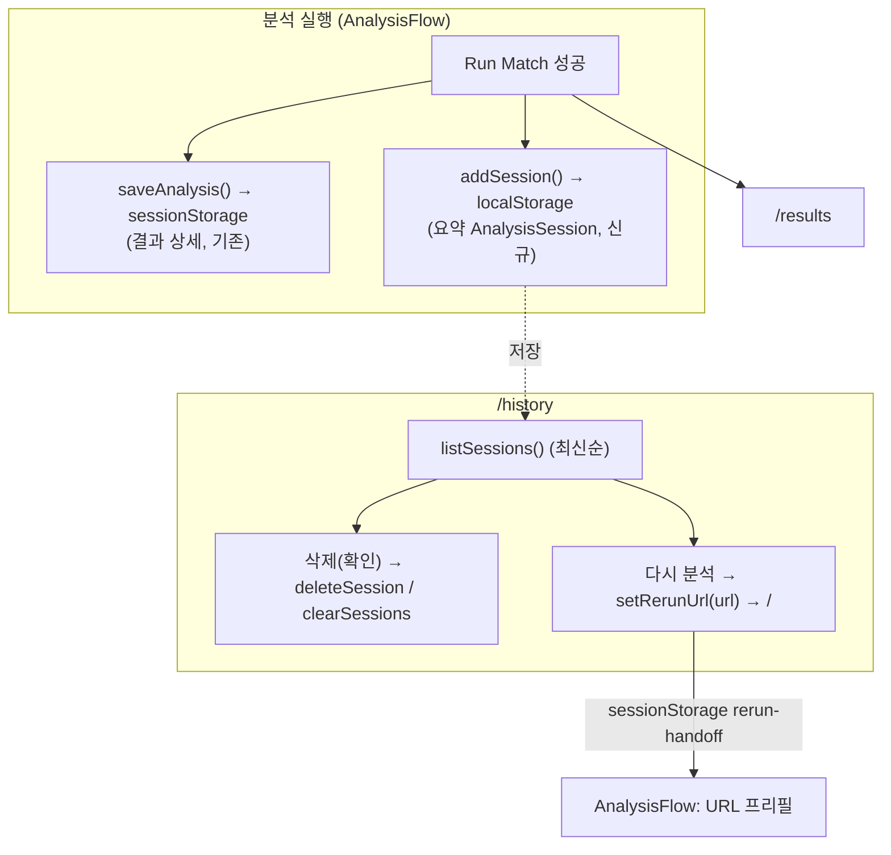

# 분석 내역(History) + 삭제(Deletion) — 설계 (localStorage, DB 없음)

**작성일:** 2026-06-01
**브랜치:** `feature/analysis-history` (base: `chore/contract-foundation`)
**관련:** PRD §6.9(분석 내역)·§6.10(삭제)·§8.6(AnalysisSession), ARCHITECTURE §3·§6.1, ADR-004·ADR-011·ADR-012

> **결정(사용자 승인 2026-06-01):** MVP는 **클라이언트 `localStorage`**로 분석 내역을 저장한다(옵션 A).
> Postgres+Prisma(ADR-012/ARCHITECTURE §6.1의 server-state 계획)는 **후속**으로 미룬다.
> 근거: DB 없이 빠르게 MVP §6.9/§6.10 충족. 저장은 파싱 메타데이터가 아니라 **요약 지표만**(원본 XML·트랙 미저장 — ADR-004 유지).

## 1. 목표

- 최근 분석을 목록으로 보여준다(분석 시각, 전체 곡 수, 누락 수 등).
- 각 내역을 **삭제**(확인 절차 포함)하고, 전체 삭제도 가능.
- "다시 분석"으로 동일 플레이리스트 URL을 새 분석 화면에 **프리필**(XML은 미저장이므로 재업로드).

## 2. 저장 모델 (요약만 — 저장 최소화)

`AnalysisSession`(이미 `types/analysis.ts`에 PRD §8.6대로 존재)만 저장한다:

```ts
type AnalysisSession = {
  id: string; playlistUrl: string; playlistId: string; createdAt: string;
  totalTrackCount: number; ownedCount: number; missingCount: number; reviewCount: number;
};
```

- 트랙 메타데이터·매칭 결과·원본 XML은 **저장하지 않는다**(ADR-004). 결과 상세는 기존 sessionStorage 핸드오프(`/results`)가 담당, 내역은 요약만.
- `localStorage` key `crate-finder:history`, 최신순, 최대 20건 유지(저장 최소화, PRD §6.9 "저장 데이터 최소화").

## 3. 데이터 흐름



## 4. 모듈/파일

| 파일 | 책임 |
|------|------|
| `src/services/analysis-history.ts` (생성) | localStorage CRUD: `listSessions`/`addSession`/`deleteSession`/`clearSessions` |
| `src/services/rerun-handoff.ts` (생성) | sessionStorage consume-once URL: `setRerunUrl`/`takeRerunUrl` |
| `src/components/playlist/PlaylistUrlForm.tsx` (수정) | `defaultUrl?` prop 추가(프리필) |
| `src/components/analysis/AnalysisFlow.tsx` (수정) | 입력 URL 보관, Run 성공 시 `addSession`, mount 시 rerun URL 프리필 |
| `src/app/history/page.tsx` (생성) | 내역 목록 + 삭제 + 전체삭제 + 다시 분석 (client) |
| `src/components/layout/TopMenuBar.tsx` (수정) | 내비 링크: New Analysis `/`, History `/history` |

> 페이지 경로는 `/history`(사용자 의미 명확). ARCHITECTURE §3의 "dashboard" = 최근 분석 목록과 동일 개념.

## 5. 계층/보안

- `analysis-history`/`rerun-handoff`는 service 계층, 도메인 타입만 의존(components import 금지). 순수 브라우저 스토리지.
- 저장 데이터에 원본 XML·API Key·로컬 경로 없음(요약 지표만) — ADR-004 준수.
- `localStorage`/`sessionStorage` 접근은 `typeof window` 가드 + try/catch(SSR·쿼터 안전), 기존 `analysis-handoff` 패턴 동일.
- 삭제는 `window.confirm`으로 확인, "되돌릴 수 없음" 문구(PRD §6.10).

## 6. UX (PRD §6.9/§6.10, §7.4 a11y)

- `/history`: 표 또는 리스트로 각 행 — 분석 시각(로컬 표기), playlist(축약), 전체/보유/누락/확인필요 카운트, [다시 분석] [삭제].
- 비어 있으면 안내 + `/`로 가는 링크.
- 헤더 내비로 New ↔ History 이동. 현재 위치는 텍스트로 구분(색 단독 의존 금지).
- mount 후 `listSessions()`를 `useEffect`로 읽어 hydration mismatch 회피(초기 null → 로딩).

## 7. 테스트

- `analysis-history.test.ts`: add→list 라운드트립(최신순), 20건 초과 시 오래된 것 제거, deleteSession, clearSessions, 손상 JSON이면 [] 반환.
- `rerun-handoff.test.ts`: set→take 1회 소비(두 번째 take는 null).
- `PlaylistUrlForm.test.tsx`: `defaultUrl` 초기값 반영(기존 테스트 회귀 없음).
- `AnalysisFlow.test.tsx`: Run 성공 시 `addSession`이 올바른 요약(카운트)으로 호출(기존 6테스트 회귀 없음).
- `history/page.test.tsx`: 목록 렌더, 삭제(확인)→목록에서 제거, 빈 상태, 다시 분석→`setRerunUrl`+`/` 이동.
- `TopMenuBar.test.tsx`: New/History 링크 존재.

## 8. 비범위 / 후속

- DB(Postgres/Prisma) 이관, 서버 동기화, 사용자 계정별 내역 — ADR-012 후속.
- 재분석 시 XML 자동 복원(원본 미저장 정책상 불가) — URL 프리필까지만.
- 결과 상세 영속화(현재 sessionStorage 1건만) — 내역에서 과거 결과 재오픈은 후속.
