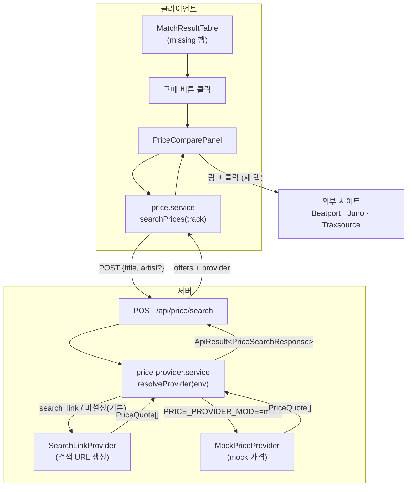

# Phase 5: Pricing & Actions — 설계 (MVP 안전 범위)

**작성일:** 2026-06-01
**브랜치:** `feature/pricing-actions` (base: `chore/contract-foundation`)
**관련 문서:** ARCHITECTURE §3·§7.4·§11, ADR-009·ADR-017, PRD §4.1.5·§6.8·§13

> **자율 작업 노트:** 본 스펙은 사용자가 부재한 상태에서 Source of Truth(PRD·ARCHITECTURE·ADR)에 근거해
> 보수적으로 self-approve 했다. 임의 결정이 필요했던 항목은 §7 **결정 로그**에 모두 명시했다(아침 리뷰용).

---

## 1. 목표

누락곡(`status === "missing"`)에 대해 **사이트별 구매 검색 링크 / 가격 후보**를 제공한다.
MVP 완료 기준 §13의 "누락곡에 대해 구매 검색 링크를 열 수 있다"를 충족한다.

실제 가격 API·크롤링은 하지 않는다(ADR-017). 가격 조회는 **Provider 패턴**(ADR-009)으로 분리해
후속 실제 연동의 확장 포인트만 마련한다.

## 2. 범위

### 2.1 In Scope

- `PriceProvider` 인터페이스 + 공유 타입 (`lib/pricing/price-provider.ts`)
- `SearchLinkProvider` — Beatport·Juno Download·Traxsource 검색 링크 생성 (순수 함수)
- `MockPriceProvider` — 결정적 mock 가격 데이터 (개발/데모용)
- `price-provider.service.ts` — **서버 전용**, `PRICE_PROVIDER_MODE` env로 provider 선택
- `/api/price/search` route — `ApiResult` 봉투 반환
- `price.service.ts` — **클라이언트 전용** fetch 헬퍼 (`analysis.service.ts` 패턴 동일)
- `PriceComparePanel` 컴포넌트 — 오퍼 목록, 새 탭 링크, 최저가 강조
- 결과 테이블 연동 — `missing` 행에 "구매" 액션 → 패널 펼침

### 2.2 Out of Scope (이번 PR 제외)

- `/api/events/purchase-click` **영속화** 및 DB(Prisma/Postgres) 도입 → §7 D1 (사용자 결정 필요)
- 실제 외부 가격 API / `ExternalApiProvider` 구현 → 확장 포인트만 (ADR-009)
- `needs_review` 행 구매 액션 → §7 D3
- TTL 캐시 / debounce → Phase 6 성능 단계로 이관

## 3. 계층 배치 (CLAUDE.md 계층 규칙 준수)

```txt
components/price/PriceComparePanel  ──(client fetch)──▶  services/price.service
                                                              │
                                                       fetch("/api/price/search")
                                                              ▼
app/api/price/search/route  ──▶  services/price-provider.service (env 읽음, 서버 전용)
                                          │
                                          ├─▶ lib/pricing/search-link-provider (순수)
                                          └─▶ lib/pricing/mock-price-provider   (순수)
```

- **서버 전용** `price-provider.service.ts`(env 접근)는 route만 import → 클라이언트 번들 미노출 (ADR-003).
- **클라이언트** `price.service.ts`는 fetch만 수행, API Key·env 접근 없음.
- `lib/pricing/*`는 순수 함수(env·fetch 없음) → TDD 우선.
- 컴포넌트는 외부 API를 **직접** 호출하지 않고 우리 라우트를 경유한다.

## 4. 데이터 흐름 (목표)



## 5. 타입 계약

### 5.1 `types/pricing.ts` (기존 `PriceQuote` 확정)

```ts
export type PriceProviderMode = "mock" | "search_link" | "external";

export type PriceQuote = {
  site: string;        // "Beatport" | "Juno Download" | "Traxsource" | ...
  price?: number;      // search_link 모드에서는 undefined
  currency?: string;   // 예: "USD"
  url: string;         // 새 탭으로 열 검색/구매 링크
  isLowest?: boolean;  // 가격 비교 시 최저가 강조용
  fetchedAt: string;   // ISO timestamp
};
```

### 5.2 `types/api.ts`에 추가 (ARCHITECTURE §7.4 확정)

```ts
export type PriceSearchRequest = {
  title: string;       // 필수
  artist?: string;
};

export type PriceSearchResponse = {
  query: string;             // 검색에 사용한 정규화 질의 (예: "daft punk one more time")
  offers: PriceQuote[];
  provider: PriceProviderMode;
};
```

> ARCHITECTURE §7.4 초안은 `PriceOffer` / `provider: "search-link"`를 썼으나, 코드 레이어는 이미
> `PriceQuote` / `PriceProviderMode`(`search_link`)를 사용 중이므로 **코드 타입으로 통일**한다(§7 D2).

### 5.3 `PriceProvider` 인터페이스 (`lib/pricing/price-provider.ts`)

```ts
import type { PriceQuote } from "@/types/pricing";

export type PriceSearchInput = { title: string; artist?: string };

export type PriceProvider = {
  mode: PriceProviderMode;
  search(input: PriceSearchInput): PriceQuote[];
};

// 질의 문자열 생성 헬퍼(provider 공유): "artist title" 또는 "title"
export function buildQuery(input: PriceSearchInput): string;
```

## 6. 컴포넌트/UX

- 결과 테이블 "Action" 열(현재 비어 있음)에 `missing` 행이면 **구매** 버튼.
- 클릭 시 해당 행 아래 `colSpan` 상세행으로 `PriceComparePanel` 펼침(테이블 가독성 유지, PRD §11).
- `MatchResultTable`은 펼침 상태(`expandedRowId`)만 갖는 client 컴포넌트로 전환(도메인 로직 없음 → 계층 규칙 위반 아님).
- `PriceComparePanel`: 마운트/펼침 시 `searchPrices` 호출 → 로딩/에러/오퍼 3분기.
  - 오퍼: 사이트명, (있으면) 가격+통화, `isLowest` 배지, 링크는 `target="_blank" rel="noopener noreferrer"`.
  - 에러: 메시지 + 재시도 버튼(PRD §7.3).
- 접근성(PRD §7.4): 버튼·링크 semantic, 가격/최저가는 색상만으로 표현하지 않음(텍스트 라벨 병기).

## 7. 결정 로그 (아침 리뷰용 — 모두 보수적·문서 정합 선택)

| ID | 결정 | 근거 | 되돌리기 |
|----|------|------|----------|
| **D1** | `/api/events/purchase-click` 영속화 + DB 도입 **보류**. 이번 PR은 링크 새 탭 열기까지만. | DB 도입은 CLAUDE.md "When Unsure"(DB 스키마 큰 변경). PRD에서도 클릭 이벤트는 P2. | 후속 PR에서 DB 결정 후 추가 |
| **D2** | 코드 타입 `PriceQuote`/`PriceProviderMode`로 통일 (doc 초안 `PriceOffer`/`search-link` 폐기). | types/pricing.ts에 이미 존재("Phase 5에서 확정" 명시). | 문서 §7.4 표기만 정리하면 됨 |
| **D3** | 구매 액션은 `status === "missing"`만 노출. | MVP §13 "누락곡". needs_review 확장은 후속. | 조건만 완화 |
| **D4** | `PRICE_PROVIDER_MODE` 미설정 시 기본 `search_link`. `external`은 미구현 → `search_link` fallback. | ADR-017(검색 링크 우선). `.env.example`은 `mock`(로컬 데모용)으로 유지. | env 매핑만 변경 |
| **D5** | 실제 가격 API / 크롤링 미구현. | ADR-009·017, PRD §5 제외. | 별도 Provider 추가 |

## 8. 테스트 전략

- `lib/pricing/search-link-provider.test.ts`: 사이트당 1개 quote, url이 site baseUrl로 시작 + 인코딩된 query 포함, price undefined.
- `lib/pricing/mock-price-provider.test.ts`: 결정적 quote 반환, 정확히 1개 `isLowest:true`, isLowest가 최저 price.
- `lib/pricing/price-provider.test.ts`: `buildQuery` — artist 있을 때 "artist title", 없을 때 "title", 정규화(trim/소문자).
- `services/price-provider.service.test.ts`: env=mock→mock provider, 미설정/search_link→search-link, external→search-link fallback, 응답 shape.
- `app/api/price/search/route.test.ts`: title 누락 시 400 + ok:false, 정상 시 ok:true + offers.
- `services/price.service.test.ts`: fetch 스파이, ok:true 언랩, ok:false throw, 비-봉투 HTTP throw (analysis.service 패턴).
- `components/price/PriceComparePanel.test.tsx`: 로딩→오퍼 렌더, 새 탭 속성, 에러+재시도, 빈 결과 안내.
- `components/results/MatchResultTable.test.tsx`: missing 행에 구매 버튼, owned 행엔 없음, 클릭 시 패널 펼침.

## 9. 보안 체크 (ADR-003/004)

- `PRICE_PROVIDER_MODE` 외 어떤 API Key도 사용하지 않음(외부 API 미연동).
- 서버 전용 `price-provider.service.ts`만 env 접근, 클라이언트 import 금지.
- 외부 링크 `rel="noopener noreferrer"` (tab-nabbing 방지).
- 로그에 트랙 원문 외 민감정보 없음(XML·키 미관여).
