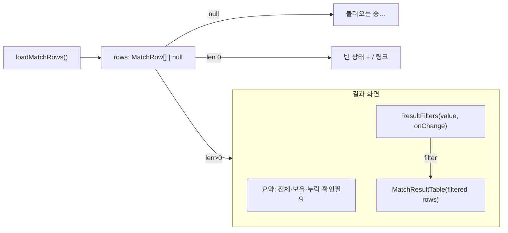

# /results 필터 + 상태 요약 연동 — 설계

**작성일:** 2026-06-01
**브랜치:** `feature/results-filters` (base: `chore/contract-foundation`)
**관련:** PRD §4.1.4(분석 요약)·§6.7(필터)·§13(누락 필터링), ARCHITECTURE §5.2

> **자율 작업 노트:** 사용자 부재 중 Source of Truth에 근거해 self-approve. 작은 UI 배선 작업이라 경량 스펙.

## 1. 문제

`ResultFilters` 컴포넌트는 이미 존재(`value`/`onChange`, `ResultFilter = "all"|"owned"|"missing"|"needs_review"`)하지만
`/results` 페이지에 **연결되어 있지 않다**. 결과 테이블만 전체 렌더된다. 따라서:
- MVP §13 "사용자가 누락곡만 필터링할 수 있다" 미충족.
- PRD §4.1.4 상태별 요약(전체/보유/누락/확인필요) 미표시.

## 2. 범위

- 주로 `src/app/results/page.tsx` 수정. 기존 `ResultFilters` 재사용(+ 선택 상태 `aria-pressed` a11y 보강).
- 필터 상태(`useState<ResultFilter>("all")`) + 상태별 카운트 요약 추가.
- 필터 적용된 행만 `MatchResultTable`에 전달. `all`이면 전체.
- 빈 필터 결과는 테이블의 기존 "No results"로 처리.

### Out of scope
- 정렬·가격순(가격 Provider 적용 후, PRD §6.7 주석). 가상 스크롤·debounce(성능 단계).
- 요약 숫자 클릭→필터 연동(추후). 요약은 표시 전용.

## 3. 동작

- 필터링: `filter === "all" ? rows : rows.filter(r => r.result.status === filter)`.
- 요약 카운트: 전체 `rows.length`, 상태별 `rows.filter(...).length` (필터와 무관하게 항상 전체 기준).

## 4. 테스트 (page.test.tsx 확장, loader는 mock 유지)

- (기존) 핸드오프 없음 → 빈 상태.
- (기존) 결과 있으면 테이블 렌더.
- 요약 라인에 상태별 카운트 표시.
- "Missing" 필터 클릭 → missing 행만 보이고 owned 행은 사라진다.
- 필터 결과가 없으면 "No results" 표시.

## 5. 접근성/계층

- 요약은 텍스트(색상 비의존), 필터는 기존 `Button`(semantic). PRD §7.4 충족.
- page는 client 컴포넌트(이미 그러함). 도메인 로직 없음 — 단순 필터링은 UI 상태.
